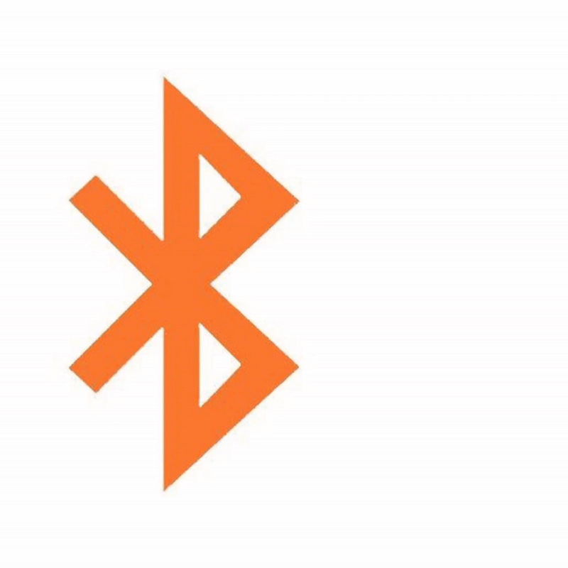

# BLE SPAM 📡
[](https://developer.android.com)
[](LICENSE)
[](https://t.me/blespam)

<p align="center">
  
</p>

## 🚀 Overview
**Next-gen BLE protocol spoofing toolkit** based on works by:
- [Willy-JL](https://github.com/Willy-JL)
- [Spooks4576](https://github.com/Spooks4576) 
- [ECTO-1A](https://github.com/ECTO-1A)

Supports cross-platform spoofing for:


## 🔥 Core Features
### Protocol Matrix
| Protocol                | Target OS          | Impact Level       |
|-------------------------|--------------------|--------------------|
| 🍏 **Apple Continuity** | iOS/iPadOS 17+     | System Reboot 💥   |
| 🤖 **Google Fast Pair** | Android 8.0+       | Persistent Spam 📈 |
| 📲 **Samsung EasySetup**| Android 10+        | UI Freeze 🛑       |
| 💻 **Microsoft Swift**  | Windows 10/11      | Custom Pairing ✨  |

### Key Capabilities
- 195+ Predefined device profiles
- Advanced timing control (20ms-2000ms)
- Multi-protocol chaining
- Adaptive antenna tuning
- Crash analytics module

## ⚙️ System Requirements
```yaml
min_android: 8.0 (API 26)
recommended_ram: 2GB+
bluetooth: LE 4.2+
storage: 15MB free
